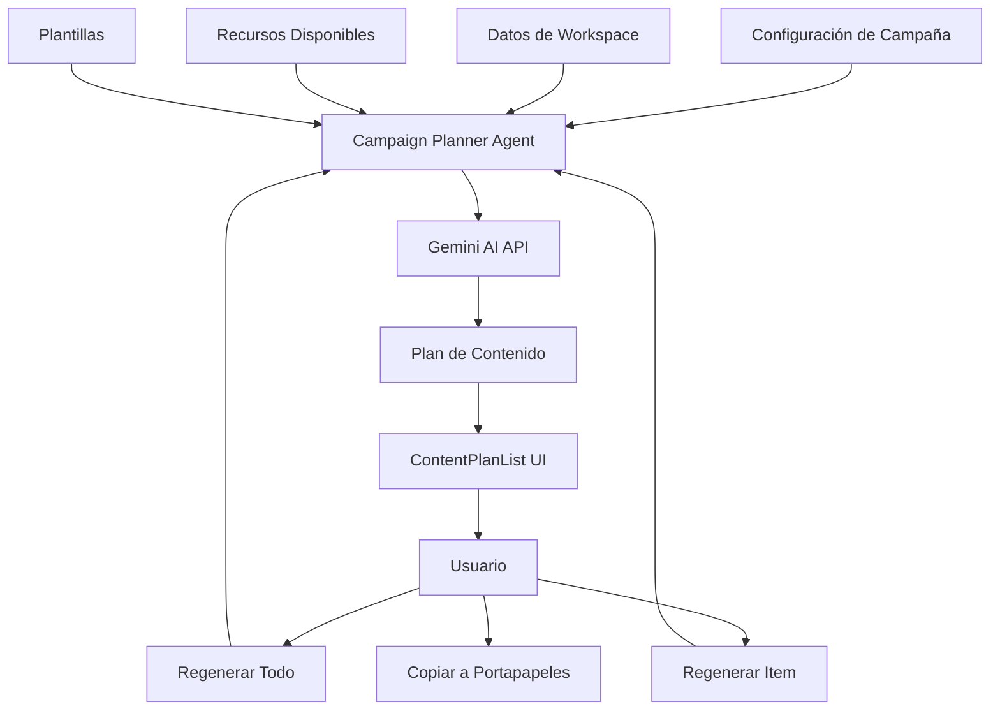

# Sistema de Planificación de Campañas - Campaign Planner Agent

## 📋 Descripción General

El **Campaign Planner Agent** es el primer agente del sistema PostIA que se encarga de orquestar y planificar el contenido de las campañas de marketing digital. Este agente toma la configuración de la campaña y los datos de la marca para generar una lista detallada de contenido que se creará durante la campaña.

### 🎯 Funcionalidad Principal

- **Planificación Inteligente**: Genera automáticamente una lista de contenido basada en la configuración de la campaña
- **Orquestación**: Actúa como el cerebro que coordina qué contenido se creará, cuándo y para qué plataforma
- **Flexibilidad**: Permite regenerar el plan completo o elementos específicos
- **Escalabilidad**: Diseñado para manejar campañas de cualquier duración y complejidad

## 🏗️ Arquitectura del Sistema

### Componentes Principales

```
📁 Campaign Planner System
├── 🤖 CampaignPlannerAgent.ts      # Agente principal de IA
├── 🔧 CampaignPlannerService.ts    # Servicio de negocio
├── 🎣 useCampaignPlanner.ts        # Hook de React
├── 📱 ContentPlanList.tsx          # Componente de UI
├── 🖥️ CampaignPlannerView.tsx     # Vista principal
├── 📚 campaign-planner-usage.ts    # Ejemplos de uso
└── 🧪 test-campaign-planner.ts     # Pruebas del sistema
```

### Flujo de Datos



## 🚀 Características Principales

### 1. Generación Inteligente de Contenido

El agente analiza:
- **Objetivo de la campaña**: Para alinear el contenido con los goals
- **Identidad de marca**: Colores, slogan, descripción, tono
- **Duración y frecuencia**: Calcula automáticamente el número de publicaciones
- **Redes sociales**: Distribuye contenido según las plataformas seleccionadas
- **Recursos disponibles**: Incorpora imágenes y videos disponibles
- **Plantillas**: Utiliza templates predefinidos cuando es apropiado

### 2. Tipos de Contenido Generados

Para cada publicación planificada se genera:
- **Título atractivo**: Headline que capte la atención
- **Descripción detallada**: Contenido específico a crear
- **Red social objetivo**: Facebook, Instagram, Twitter, LinkedIn, etc.
- **Tipo de contenido**: Post, Story, Reel, Carousel
- **Fecha programada**: Basada en el intervalo configurado
- **Prioridad**: Alta, Media, Baja según impacto esperado
- **Tags relevantes**: Hashtags y etiquetas sugeridas
- **Recursos asignados**: Imágenes/videos a utilizar
- **Plantilla sugerida**: Template recomendado
- **Notas adicionales**: Información extra para el creador

### 3. Capacidades de Regeneración

- **Regeneración completa**: Crea un plan totalmente nuevo
- **Regeneración específica**: Modifica solo un elemento del plan
- **Contexto preservado**: Mantiene coherencia con el resto del plan
- **Mejora iterativa**: Cada regeneración considera el feedback implícito

## 📊 Datos de Entrada y Salida

### Entrada (Input)

```typescript
interface GenerateContentPlanParams {
  campaign: {
    id: string
    name: string
    objective: string
    startDate: string
    endDate: string
    socialNetworks: string[]
    intervalHours: number
    contentType: 'unified' | 'optimized'
    prompt: string
  }
  workspace: {
    id: string
    name: string
    branding: {
      primaryColor: string
      secondaryColor: string
      logo?: string
      slogan: string
      description: string
      whatsapp?: string
    }
  }
  resources?: ResourceData[]
  templates?: TemplateData[]
}
```

### Salida (Output)

```typescript
interface ContentPlanItem {
  id: string
  title: string                    // "Rutina matutina para empezar el día"
  description: string              // "Contenido motivacional sobre..."
  socialNetwork: string            // "instagram"
  scheduledDate: string            // "2024-06-01T09:00:00Z"
  templateId?: string              // "tpl-001"
  resourceIds: string[]            // ["res-001", "res-002"]
  contentType: string              // "post" | "story" | "reel" | "carousel"
  estimatedReach?: number          // 1500
  priority: string                 // "high" | "medium" | "low"
  tags: string[]                   // ["fitness", "morning", "routine"]
  notes?: string                   // "Incluir call-to-action al final"
}
```

## 🎨 Interfaz de Usuario

### Vista Principal (CampaignPlannerView)

- **Estado inicial**: Botón para generar plan con resumen de campaña
- **Estado de carga**: Spinner con mensaje "Generando plan de contenido..."
- **Estado de éxito**: Lista completa de contenido planificado
- **Estado de error**: Mensaje de error con opción de reintentar

### Lista de Contenido (ContentPlanList)

- **Header con acciones**: Volver, Regenerar todo, Copiar (PostIA)
- **Cards de contenido**: Información detallada de cada publicación
- **Acciones por item**: Regenerar elemento específico
- **Estadísticas**: Resumen por redes, tipos y prioridades

### Características de UX

- **Feedback visual**: Estados de carga para cada acción
- **Información contextual**: Tooltips y descripciones claras
- **Acciones rápidas**: Botones accesibles para regenerar
- **Responsive design**: Funciona en desktop y móvil
- **Accesibilidad**: Colores contrastantes y navegación por teclado

## 🔧 Uso del Sistema

### 1. Integración Básica

```typescript
import { CampaignPlannerView } from '@/components/campaign/CampaignPlannerView'

function CampaignPage() {
  const [campaign, setCampaign] = useState<CampaignData>(...)
  const [workspace, setWorkspace] = useState<WorkspaceData>(...)
  
  return (
    <CampaignPlannerView
      campaign={campaign}
      workspace={workspace}
      resources={resources}
      templates={templates}
      onBackToCampaign={() => setView('config')}
      autoGenerate={true}
    />
  )
}
```

### 2. Uso del Hook

```typescript
import { useCampaignPlanner } from '@/hooks/useCampaignPlanner'

function CustomCampaignComponent() {
  const {
    contentPlan,
    isLoading,
    error,
    generateContentPlan,
    regenerateContentPlan,
    regenerateContentItem
  } = useCampaignPlanner()

  const handleGenerate = async () => {
    await generateContentPlan({
      campaign: campaignData,
      workspace: workspaceData,
      resources: resourcesData,
      templates: templatesData
    })
  }

  // ... resto del componente
}
```

### 3. Uso del Servicio Directamente

```typescript
import { getCampaignPlannerService } from '@/lib/ai/services/CampaignPlannerService'

async function generatePlan() {
  const service = getCampaignPlannerService()
  
  const contentPlan = await service.generateContentPlan({
    campaign: campaignData,
    workspace: workspaceData,
    resources: [],
    templates: []
  })
  
  console.log(`Plan generado: ${contentPlan.length} publicaciones`)
}
```

## 🧪 Testing y Validación

### Pruebas Automatizadas

El sistema incluye un conjunto completo de pruebas:

```bash
# Ejecutar todas las pruebas
import { runAllTests } from '@/lib/ai/test-campaign-planner'
await runAllTests()

# Ejecutar prueba específica
import { testBasicGeneration } from '@/lib/ai/test-campaign-planner'
await testBasicGeneration()
```

### Validación de Datos

```typescript
const service = getCampaignPlannerService()
const validation = service.validateCampaignData(campaign)

if (!validation.isValid) {
  console.log('Errores:', validation.errors)
}
```

## 📈 Métricas y Estadísticas

### Estadísticas del Plan

```typescript
const stats = service.calculatePlanStatistics(contentPlan)

console.log({
  totalPosts: stats.totalPosts,
  postsByNetwork: stats.postsByNetwork,    // { instagram: 5, facebook: 3 }
  postsByType: stats.postsByType,          // { post: 6, story: 2 }
  postsByPriority: stats.postsByPriority, // { high: 2, medium: 4, low: 2 }
  averagePostsPerDay: stats.averagePostsPerDay
})
```

### Métricas del Agente

```typescript
const aiService = getAIAgentService()
const metrics = aiService.getAgentMetrics('campaign-planner')

console.log({
  totalRequests: metrics.totalRequests,
  successRate: metrics.successfulRequests / metrics.totalRequests,
  averageResponseTime: metrics.averageResponseTime,
  totalTokensUsed: metrics.totalTokensUsed
})
```

## 🔮 Funcionalidad "PostIA"

### Botón PostIA

El botón "PostIA" en la interfaz tiene una funcionalidad especial:

1. **Estado actual**: Copia el plan al portapapeles en formato legible
2. **Futuro**: Enviará el plan a los agentes de creación de contenido

### Formato de Copia

```
📋 PLAN DE CONTENIDO DE CAMPAÑA
==================================================

1. Rutina matutina para empezar el día
   📅 Fecha: lunes, 1 de junio de 2024, 09:00
   📱 Red Social: 📷 instagram
   📝 Tipo: post
   🎯 Prioridad: high
   📄 Descripción: Contenido motivacional sobre...
   🏷️ Tags: fitness, morning, routine
   
----------------------------------------

📊 RESUMEN:
Total de publicaciones: 14
Redes sociales: instagram, facebook
Tipos de contenido: post, story, reel
Prioridades: Alta (3), Media (8), Baja (3)

🚀 Generado por PostIA - Sistema de Agentes de IA
```

## 🚀 Próximos Pasos

### Integración con Otros Agentes

1. **Content Creator Agent**: Recibirá cada item del plan para generar el contenido real
2. **Visual Content Advisor**: Creará las imágenes y videos necesarios
3. **Brand Strategist**: Validará que el contenido esté alineado con la marca
4. **Analytics Interpreter**: Analizará el rendimiento del contenido generado

### Mejoras Planificadas

- **Templates inteligentes**: Sugerencia automática de plantillas
- **Optimización por plataforma**: Contenido específico para cada red social
- **A/B Testing**: Generación de variantes para probar
- **Calendario visual**: Vista de calendario del plan generado
- **Exportación**: PDF, Excel, y otros formatos
- **Colaboración**: Comentarios y aprobaciones en el plan

## 🛠️ Configuración y Mantenimiento

### Variables de Entorno

```env
GEMINI_API_KEY=your_gemini_api_key
GEMINI_DEFAULT_MODEL=gemini-1.5-flash
GEMINI_PRO_MODEL=gemini-1.5-pro
AI_MAX_CONCURRENT_REQUESTS=5
```

### Monitoreo

```typescript
// Verificar estado de salud
const healthCheck = await aiService.healthCheck()
console.log('Estado del sistema:', healthCheck.status)

// Obtener estadísticas
const systemStats = aiService.getSystemStats()
console.log('Estadísticas:', systemStats)
```

## 📚 Recursos Adicionales

- **Ejemplos de uso**: `src/lib/ai/examples/campaign-planner-usage.ts`
- **Pruebas**: `src/lib/ai/test-campaign-planner.ts`
- **Tipos TypeScript**: `src/lib/ai/agents/types.ts`
- **Documentación de API**: Comentarios JSDoc en el código

---

## 🎉 Conclusión

El **Campaign Planner Agent** es la base del sistema PostIA, proporcionando una planificación inteligente y escalable para campañas de marketing digital. Su diseño modular y extensible permite futuras mejoras y la integración con otros agentes del sistema.

**Características clave:**
- ✅ Generación automática de planes de contenido
- ✅ Interfaz de usuario intuitiva y responsive
- ✅ Sistema de regeneración flexible
- ✅ Validación robusta de datos
- ✅ Métricas y estadísticas detalladas
- ✅ Arquitectura escalable y mantenible
- ✅ Pruebas automatizadas completas

El sistema está listo para producción y preparado para la integración con los próximos agentes del ecosistema PostIA.